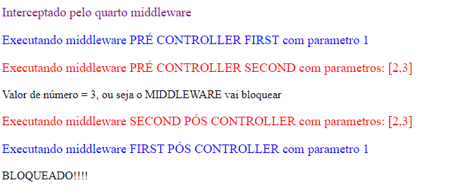
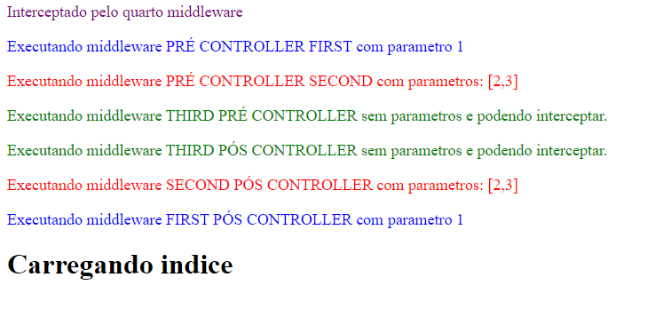

# Middleware com Gerenciamento de Login

1. [Registrando Middlewares](#registrando-middlewares)
2. [Entendendo o funcionamento de Middlewares](#entendendo-o-funcionamento-de-middlewares)
3. [Login no Laravel](#login-no-laravel)

## Registrando Middlewares
[Documentação](https://laravel.com/docs/8.x/middleware#introduction)

### Estrutura
Um middleware faz uma interceptação de requisição HTTP, geralmente usado para critérios de segurança, como por exemplo verificar se um usuário está logado por exemplo e caso não esteja, interceptar a requisição de modo que uma página que exige autenticação não carregue, esse seria um exemplo clássico de um middleware. No laravel existe quatro formas de fazer uso desse recurso, para tal, teremos [um controlador](./app/Http/Controllers/ControladorController.php) e quatro middleware,cada um deles interceptando de uma forma diferente.

### Criando um Middleware pelo Artisan
    php artisan make:middleware [nome]

Válido sempre ressaltar que a parte `[nome]` deve ser substituido pelo nome da classe correspondente. No exemplo abaixo o `middleware` se chama *Primeiro* e deve ter uma estrutura como essa:

    namespace App\Http\Middleware;
    use Closure;
    use Illuminate\Http\Request;

    class Primeiro
    {
        
        public function handle(Request $request, Closure $next)
        {
            return $next($request);
        }
    }

No caso toda a lógica referente a interceptação deve estar dentro da função `handle`, que vem da classe `\Illuminate\Http\Request`. A lógica aqui é semelhante ao `express` do javascript ou a qualquer outra coisa estruturada dessa forma, no caso se essa função `$next($request);` não for chamado passando o parametro `$request` o cliente não terá acesso ao conteúdo, mas continuando... No primeiro exemplo temos um middleware, Arquivo [Primeiro.php](./app/Http/Middleware/Primeiro.php): 

### Primeira forma: A forma mais simples e tradicional
    <?php
        namespace App\Http\Middleware;
        use Closure;
        use Illuminate\Http\Request;
        class Primeiro
        {
            public function handle(Request $request, Closure $next)
            {
                echo "
Interceptado pelo primeiro middleware
";        
                return $next($request);
            }
        }

A primeira forma de registra-lo é encadeando o método `middleware` na rota, conforme visto no arquivo [web.php](./routes/web.php): `Route::get('/middleware',"\App\Http\Controllers\ControladorController@index")->middleware(\App\Http\Middleware\Primeiro::class);`, nesse caso ao encadear o método middleware a classe passada como parametro será usada para fazer a devida interceptação, lembre-se esse método aceita uma *Classe* como argumento, se for o caso o namespace deve ser informado. Além disso você não precisa importar nada no controlador por esse método, conforme visto no arquivo [ControladorController.php](./app/Http/Controllers/ControladorController.php).

    <?php
        namespace App\Http\Controllers;
        use Illuminate\Http\Request;
        class ControladorController extends Controller
        {
            public function index(){
                return " Middleware index";
            }
        }

### Segunda Forma: Nomeando o middleware
Essa segunda requer que você registre o seu middleware no arquivo [Kernel.php](./app/Http/Kernel.php), nesse arquivo está todas os middleware que o Laravel usa, no entando, a rota em questão deve ser registrado dentro do array `$routeMiddleware`, também é válido lembrar que o carregamento das rotas é feito de cima para baixo:

    /**
     * The application's route middleware.
     *
     * These middleware may be assigned to groups or used individually.
     *
     * @var array
     */
    protected $routeMiddleware = [
        'auth' => \App\Http\Middleware\Authenticate::class,
        'auth.basic' => \Illuminate\Auth\Middleware\AuthenticateWithBasicAuth::class,
        'cache.headers' => \Illuminate\Http\Middleware\SetCacheHeaders::class,
        'can' => \Illuminate\Auth\Middleware\Authorize::class,
        'guest' => \App\Http\Middleware\RedirectIfAuthenticated::class,
        'password.confirm' => \Illuminate\Auth\Middleware\RequirePassword::class,
        'signed' => \Illuminate\Routing\Middleware\ValidateSignature::class,
        'throttle' => \Illuminate\Routing\Middleware\ThrottleRequests::class,
        'verified' => \Illuminate\Auth\Middleware\EnsureEmailIsVerified::class,

        'segundo' => \App\Http\Middleware\Segundo::class
    ];

###### Segundo Middleware
[Segundo](./app/Http/Middleware/Segundo.php)

    <?php

    namespace App\Http\Middleware;

    use Closure;
    use Illuminate\Http\Request;

    class Segundo
    {
        /**
         * Handle an incoming request.
         *
         * @param  \Illuminate\Http\Request  $request
         * @param  \Closure  $next
         * @return mixed
         */
        public function handle(Request $request, Closure $next)
        {
            echo "
Interceptado pelo segundo middleware
"; 
            return $next($request);
        }
    }

Repare que com essa rota adicionado `'segundo' => \App\Http\Middleware\Segundo::class` a nossa rota passa ter um nome, podendo ser reaproveitada por outros middlewares e claro, sem ter que expor o arquivo em questão. Agora basta adicionar o nome da rota em formato string a o método middleware, conforme o arquivo [web.php](./routes/web.php) ilustra:

    Route::get('/middleware',"\App\Http\Controllers\ControladorController@index")
        ->middleware(\App\Http\Middleware\Primeiro::class)
        ->middleware('segundo');

### Terceira forma: Instanciando no Controller.
Esse exemplo usaremos apenas para a terceira forma, repare que as outras duas primeiras sequer aparece no controlador como essa terceira forma:

###### Controller
[ControladorController.php](./app/Http/Controllers/ControladorController.php)

    <?php

        namespace App\Http\Controllers;
        use Illuminate\Http\Request;
        class ControladorController extends Controller
        {
            public function __construct()
            {
                $this->middleware(\App\Http\Middleware\Terceiro::class);        
            }
            public function index(){
                return " Middleware index";
            }
        }

###### Middleware
[Terceiro](./app/Http/Middleware/Terceiro.php)

    <?php
        namespace App\Http\Middleware;

        use Closure;
        use Illuminate\Http\Request;

        class Terceiro
        {
            /**
             * Handle an incoming request.
             *
             * @param  \Illuminate\Http\Request  $request
             * @param  \Closure  $next
             * @return mixed
             */
            public function handle(Request $request, Closure $next)
            {
                echo "
Interceptado pelo terceiro middleware
"; 
                return $next($request);
            }
        }

Nessa terceira forma você chama o middleware através do construtor, você pode chamar direto a classe `$this->middleware(\App\Http\Middleware\Terceiro::class);` ou registrar-la no arquivo [Kernel.php](./app/Http/Kernel.php) e então chamar-la pelo nome dela, no caso `$this->middleware("[nome]");`, devendo `[nome]` ser o equivalente ao *nome* registrado no [Kernel.php](./app/Http/Kernel.php).

### Quarta forma: Forma Global
[Quarto.php](./app/Http/Middleware/Quarto.php)

    <?php

    namespace App\Http\Middleware;    
    use Closure;
    use Illuminate\Http\Request;

    class Quarto
    {
        /**
         * Handle an incoming request.
         *
         * @param  \Illuminate\Http\Request  $request
         * @param  \Closure  $next
         * @return mixed
         */
        public function handle(Request $request, Closure $next)
        {
            echo "
Interceptado pelo quarto middleware
"; 
            return $next($request);
        }
    }

[Kernel.php](./app/Http/Kernel.php)

    protected $middlewareGroups = [
        'web' => [
            \App\Http\Middleware\EncryptCookies::class,
            \Illuminate\Cookie\Middleware\AddQueuedCookiesToResponse::class,
            \Illuminate\Session\Middleware\StartSession::class,
            // \Illuminate\Session\Middleware\AuthenticateSession::class,
            \Illuminate\View\Middleware\ShareErrorsFromSession::class,
            \App\Http\Middleware\VerifyCsrfToken::class,
            \Illuminate\Routing\Middleware\SubstituteBindings::class,

            //Quarto Middleware adicionado
            \App\Http\Middleware\Quarto::class
        ],

        'api' => [
            'throttle:api',
            \Illuminate\Routing\Middleware\SubstituteBindings::class,
        ],
    ];

Dessa forma tudo que você deve fazer é ir ao arquivo [Kernel.php](./app/Http/Kernel.php) e adicionar o middleware no array `$middlewareGroups` e mais nada, não precisa registrar em nenhum método middleware, porém nesse método o seu middleware será carregado junto com o Laravel e de maneira global, apenas faça isso se quiser que todas as rotas do Laravel possam ser interceptadas pelo middleware.

**Se tudo funcionar corretamente:**

## Entendendo o funcionamento de Middlewares

###### First.php
[First.php](./app/Http/Middleware/First.php)

    <?php

        namespace App\Http\Middleware;
        use Closure;
        use Illuminate\Http\Request;

        class First
        {          
            public function handle(Request $request, Closure $next, $param1)
            {
                echo "
Executando  middleware PRÉ CONTROLLER FIRST com parametro $param1
";
                $req = $next($request);
                echo "
Executando middleware FIRST PÓS CONTROLLER com parametro $param1
";
                return $req;
            }
        }

**Repare que a classe `first` recebe um parametro, conforme visto aqui `$param1`.**

###### Second.php
[Second](./app/Http/Middleware/Second.php)

    <?php

        namespace App\Http\Middleware;

        use Closure;
        use Illuminate\Http\Request;

        class Second
        {            
            public function handle(Request $request, Closure $next, $param1, $param2)
            {
                echo "
Executando middleware PRÉ CONTROLLER SECOND com parametros: [$param1,$param2]
";
                $req = $next($request);
                echo "
Executando middleware SECOND PÓS CONTROLLER com parametros: [$param1,$param2]
";
                return $req;
            }
        }

**Repare que essa classe aceita 2 argumentos, conforme visto aqui `$param1, $param2`.**

###### Third.php
[Third.php](./app/Http/Middleware/Third.php)

    <?php

        namespace App\Http\Middleware;
        use Closure;
        use Illuminate\Http\Request;

        class Third
        {
            public function handle(Request $request, Closure $next)
            {
                $numero = random_int(0,10);
                if($numero >= 5){
                    echo "
Executando middleware THIRD PRÉ CONTROLLER sem parametros e podendo interceptar.
";
                    $req = $next($request);
                }else{
                    echo "Valor de número = $numero, ou seja o MIDDLEWARE vai bloquear";
                    return response("BLOQUEADO!!!!",403);
                }
                
                echo "
Executando middleware THIRD PÓS CONTROLLER sem parametros e podendo interceptar.
";
                return $req;
            }
        }

### Entendendo os Middlewares

###### Registrando os Middlewares
    Route::get('/controle',"\App\Http\Controllers\IndexCtrl@index")
    ->middleware(
        "\App\Http\Middleware\First:1",
        "\App\Http\Middleware\Second:2,3",
        "\App\Http\Middleware\Third"
    );

#### Sobre os parametros passados ao Middleware.
Aqui está sendo registrado os middlewares, essa é uma forma possível quando você quer passar parametros ao middleware, você poderia nomear as rotas e colocar os dois pontos após o nome registrado no arquivo **Kernel.php**. Porém definido isso, conforme visto aqui `"\App\Http\Middleware\First:1"`, tudo que houver após os dois pontos, será passado como argumento. A exemplo dessa classe [FIRST](#firstphp), nesse caso tem como parametro `1` e será passado como argumento para `$param1`, se você quiser passar mais de um argumento, você pode usar a `,` como separador, conforme visto aqui `"\App\Http\Middleware\Second:2,3"`, no [SECOND](#secondphp), repare que em ambos, os parametros adicionais são informados na assinatura do método `handler`.

#### Brecando o carregamento do indice:

    public function handle(Request $request, Closure $next)
        {
            $numero = random_int(0,10);
            if($numero >= 5){
                echo "
Executando middleware THIRD PRÉ CONTROLLER sem parametros e podendo interceptar.
";
                $req = $next($request);
            }else{
                echo "Valor de número = $numero, ou seja o MIDDLEWARE vai bloquear";
                return response("BLOQUEADO!!!!",403);
            }
            
            echo "
Executando middleware THIRD PÓS CONTROLLER sem parametros e podendo interceptar.
";
            return $req;
        }

Nesse caso você se essa condição `if($numero >= 5)` for falsa, a execução será suspensa, devido ao visto aqui `return response("BLOQUEADO!!!!",403);`, no caso esse `$numero` recebe um número aleatório ente *1* e *10*, conforme esta expressão: `$numero = random_int(0,10);`. Abaixo um exemplo quando o middleware suspende a execução:

### ordem de execução dos Middlewares
[IndexCtrl](./app/Http/Controllers/IndexCtrl.php)

    <?php
        namespace App\Http\Controllers;
        use Illuminate\Http\Request;
        class IndexCtrl extends Controller
        {
            public function index(){
                return "<h1>Carregando indice</h1>";
            }
        }

**Existe uma ordem para a execução de middlewares, inicialmente é executado do primeiro middleware até o ultimo sequencialmente, porém quando todos os middlewares são executados, a exibição passa a ocorre de maneira inversa, ou seja o ultimo middleware é executado antes do primeiro, em outras palavras: o primeiro middleware é executado, depois o segundo e por fim o terceiro, no caso todo o trecho antes da chamada do next, uma vez que todo o trecho da chamada do next é executado, começar a ser executado o trecho após a chamada do next, começando do terceiro, indo ao segundo e após isso voltando ao primeiro, lembrando que nessa rota de volta, a requisição já foi carregada e com isso é possível fazer pós processamento, e ai depois de todo esse processo de ida e volta gerado pelos middlewares, ai sim a requisição é carregada. Segue um print abaixo para clarificar isso:**

## Login no Laravel
Para habilitar o login no Laravel 5 basta dar o comando `php artisan make:auth`, porém na atual versão (8.0), a maneira é um pouco diferente...

### composer require laravel/ui "^[VERSAO]"
    composer require laravel/ui "^1.0" --dev

**OU**

    composer require laravel/ui "^2.0"

Repare que a flag `--dev` indica desenvolvimento e não deve ser usado em ambiente de produção, você precisa instalar o `laravel/ui` para ter acesso a um wizard nas novas versões do *Laravel*.

#### Possível erro

     Problem 1
    - laravel/ui[v1.0.0, ..., 1.x-dev] require illuminate/console ~5.8|^6.0 -> found illuminate/console[v5.8.0, ..., 5.8.x-dev, v6.0.0, ..., 6.x-dev] but these were not loaded, likely because it conflicts with another require.
    - Root composer.json requires laravel/ui ^1.0 -> satisfiable by laravel/ui[v1.0.0, ..., 1.x-dev].

Se um erro semelhante ao informado acima, verifique as versões dos pacotes instalados no projeto, se você está usando a versão mais nova do `Laravel` convém usar a versão mais nova do `laravel/ui`. Além disso o `^` indica que será instalado o recurso entre a versão `2.0.0` e `2.9.9`.

### Instalando o bootstrap
    php artisan ui bootstrap

Dessa forma você instala o bootstrap e é solicitado a rodar o *npm*: `Please run "npm install && npm run dev" to compile your fresh scaffolding.`    
### ui com VUE
Aqui usaremos o utilitário executando: `php artisan ui vue --auth`, uma vez que o mesmo seja instalado seguindo os [passos acima](#login-no-laravel). Após isso recomenda-se rodar o `npm i` e o `npm i -D`, ou seja atualizar os pacotes npm de produção e desenvolvimento. Nesse exemplo está sendo instalado o vue junto no front-end e é solicitado a rodar o *npm*: `Please run "npm install && npm run dev" to compile your fresh scaffolding.`.

### ui auth

    php artisan ui:auth

Esse Script deve ser executado antes ou depois de instalar o `vue` ou o `bootstrap` caso você instale isso, esse script irá criar alguns arquivos:

[web.php](routes/web.php)

    Auth::routes();
    Route::get('/home', 'HomeController@index')->name('home');

Além disso irá criar os seguintes arquivos PHP: 

[ConfirmPasswordController.php](app/Http/Controllers/Auth/ConfirmPasswordController.php) -> Confirmação de Senhas.

[ForgotPasswordController.php](app/Http/Controllers/Auth/ForgotPasswordController.php) -> Página de registro para redefinição de uma nova senha.

[LoginController.php](app/Http/Controllers/Auth/LoginController.php) -> Página para Login.

[RegisterController.php](app/Http/Controllers/Auth/RegisterController.php) -> Página para registro de uma nova conta.

[ResetPasswordController.php](app/Http/Controllers/Auth/ResetPasswordController.php) -> Página que irá proceder com o reset da senha.

[VerificationController.php](app/Http/Controllers/Auth/VerificationController.php) -> Página que lida com verificação de e-mail.

#### Home Controller
[Arquivo](app/Http/Controllers/HomeController.php), Esse será o controller que o *Laravel* criará para acessar o login de usuário na aplicação.

    <?php

        namespace App\Http\Controllers;

        use Illuminate\Http\Request;

        class HomeController extends Controller
        {
            /**
            * Create a new controller instance.
            *
            * @return void
            */
            public function __construct()
            {
                $this->middleware('auth');
            }

            /**
            * Show the application dashboard.
            *
            * @return \Illuminate\Contracts\Support\Renderable
            */
            public function index()
            {
                return view('home');
            }
        }

### Erros ao executar o "php artisan route:list"
Se houver algum erro ao executar esse comando `php artisan route:list`, vai até o arquivo de rotas [web.php](routes/web.php), nesse arquivo você coloca o caminho absoluto a rota, no caso na rota de autenticação você deve encontrar algo como:
###### Path para homeController errado:
    Route::get('/home', 'HomeController@index')->name('home');

**Sendo que o mesmo deve ficar:**

###### Path para homeController Certo:
    Route::get('/home', '\App\Http\Controllers\HomeController@index')->name('home');

### Tabela de rotas
Uma vez que o problema de rotas esteja resolvido o output deve ser algo como:

    +--------+----------+------------------------+------------------+------------------------------------------------------------------------+---------------------------------+
    | Domain | Method   | URI                    | Name             | Action                                                                 | Middleware                      |
    +--------+----------+------------------------+------------------+------------------------------------------------------------------------+---------------------------------+
    |        | GET|HEAD | /                      |                  | Closure                                                                | web                             |
    |        | GET|HEAD | api/user               |                  | Closure                                                                | api                             |
    |        |          |                        |                  |                                                                        | auth:api                        |
    |        | GET|HEAD | controle               |                  | App\Http\Controllers\IndexCtrl@index                                   | web                             |
    |        |          |                        |                  |                                                                        | \App\Http\Middleware\First:1    |
    |        |          |                        |                  |                                                                        | \App\Http\Middleware\Second:2,3 |
    |        |          |                        |                  |                                                                        | \App\Http\Middleware\Third      |
    |        | GET|HEAD | home                   | home             | App\Http\Controllers\HomeController@index                              | web                             |
    |        |          |                        |                  |                                                                        | auth                            |
    |        | GET|HEAD | login                  | login            | App\Http\Controllers\Auth\LoginController@showLoginForm                | web                             |
    |        |          |                        |                  |                                                                        | guest                           |
    |        | POST     | login                  |                  | App\Http\Controllers\Auth\LoginController@login                        | web                             |
    |        |          |                        |                  |                                                                        | guest                           |
    |        | POST     | logout                 | logout           | App\Http\Controllers\Auth\LoginController@logout                       | web                             |
    |        | GET|HEAD | middleware             |                  | App\Http\Controllers\ControladorController@index                       | web                             |
    |        |          |                        |                  |                                                                        | App\Http\Middleware\Primeiro    |
    |        |          |                        |                  |                                                                        | segundo                         |
    |        |          |                        |                  |                                                                        | App\Http\Middleware\Terceiro    |
    |        | GET|HEAD | password/confirm       | password.confirm | App\Http\Controllers\Auth\ConfirmPasswordController@showConfirmForm    | web                             |
    |        |          |                        |                  |                                                                        | auth                            |
    |        | POST     | password/confirm       |                  | App\Http\Controllers\Auth\ConfirmPasswordController@confirm            | web                             |
    |        |          |                        |                  |                                                                        | auth                            |
    |        | POST     | password/email         | password.email   | App\Http\Controllers\Auth\ForgotPasswordController@sendResetLinkEmail  | web                             |
    |        | GET|HEAD | password/reset         | password.request | App\Http\Controllers\Auth\ForgotPasswordController@showLinkRequestForm | web                             |
    |        | POST     | password/reset         | password.update  | App\Http\Controllers\Auth\ResetPasswordController@reset                | web                             |
    |        | GET|HEAD | password/reset/{token} | password.reset   | App\Http\Controllers\Auth\ResetPasswordController@showResetForm        | web                             |
    |        | GET|HEAD | register               | register         | App\Http\Controllers\Auth\RegisterController@showRegistrationForm      | web                             |
    |        |          |                        |                  |                                                                        | guest                           |
    |        | POST     | register               |                  | App\Http\Controllers\Auth\RegisterController@register                  | web                             |
    |        |          |                        |                  |                                                                        | guest                           |
    +--------+----------+------------------------+------------------+------------------------------------------------------------------------+---------------------------------+

Essas rotas acima, são criados com base nos script [php artisan ui:auth](#ui-auth)