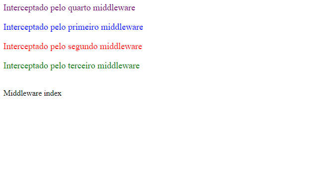

# Middleware com Gerenciamento de Login

1. [Registrando Middlewares](#registrando-middlewares)

## Registrando Middlewares
[Documentação](https://laravel.com/docs/8.x/middleware#introduction)

### Estrutura
Um middleware faz uma interceptação de requisição HTTP, geralmente usado para critérios de segurança, como por exemplo verificar se um usuário está logado por exemplo e caso não esteja, interceptar a requisição de modo que uma página que exige autenticação não carregue, esse seria um exemplo clássico de um middleware. No laravel existe quatro formas de fazer uso desse recurso, para tal, teremos [um controlador](./app/Http/Controllers/ControladorController.php) e quatro middleware,cada um deles interceptando de uma forma diferente.

### Criando um Middleware pelo Artisan
    php artisan make:middleware [nome]

Válido sempre ressaltar que a parte `[nome]` deve ser substituido pelo nome da classe correspondente. No exemplo abaixo o `middleware` se chama *Primeiro* e deve ter uma estrutura como essa:

    namespace App\Http\Middleware;
    use Closure;
    use Illuminate\Http\Request;

    class Primeiro
    {
        
        public function handle(Request $request, Closure $next)
        {
            return $next($request);
        }
    }

No caso toda a lógica referente a interceptação deve estar dentro da função `handle`, que vem da classe `\Illuminate\Http\Request`. A lógica aqui é semelhante ao `express` do javascript ou a qualquer outra coisa estruturada dessa forma, no caso se essa função `$next($request);` não for chamado passando o parametro `$request` o cliente não terá acesso ao conteúdo, mas continuando... No primeiro exemplo temos um middleware, Arquivo [Primeiro.php](./app/Http/Middleware/Primeiro.php): 

### Primeira forma: A forma mais simples e tradicional
    <?php
        namespace App\Http\Middleware;
        use Closure;
        use Illuminate\Http\Request;
        class Primeiro
        {
            public function handle(Request $request, Closure $next)
            {
                echo "
Interceptado pelo primeiro middleware
";        
                return $next($request);
            }
        }

A primeira forma de registra-lo é encadeando o método `middleware` na rota, conforme visto no arquivo [web.php](./routes/web.php): `Route::get('/middleware',"\App\Http\Controllers\ControladorController@index")->middleware(\App\Http\Middleware\Primeiro::class);`, nesse caso ao encadear o método middleware a classe passada como parametro será usada para fazer a devida interceptação, lembre-se esse método aceita uma *Classe* como argumento, se for o caso o namespace deve ser informado. Além disso você não precisa importar nada no controlador por esse método, conforme visto no arquivo [ControladorController.php](./app/Http/Controllers/ControladorController.php).

    <?php
        namespace App\Http\Controllers;
        use Illuminate\Http\Request;
        class ControladorController extends Controller
        {
            public function index(){
                return " Middleware index";
            }
        }

### Segunda Forma: Nomeando o middleware
Essa segunda requer que você registre o seu middleware no arquivo [Kernel.php](./app/Http/Kernel.php), nesse arquivo está todas os middleware que o Laravel usa, no entando, a rota em questão deve ser registrado dentro do array `$routeMiddleware`, também é válido lembrar que o carregamento das rotas é feito de cima para baixo:

    /**
     * The application's route middleware.
     *
     * These middleware may be assigned to groups or used individually.
     *
     * @var array
     */
    protected $routeMiddleware = [
        'auth' => \App\Http\Middleware\Authenticate::class,
        'auth.basic' => \Illuminate\Auth\Middleware\AuthenticateWithBasicAuth::class,
        'cache.headers' => \Illuminate\Http\Middleware\SetCacheHeaders::class,
        'can' => \Illuminate\Auth\Middleware\Authorize::class,
        'guest' => \App\Http\Middleware\RedirectIfAuthenticated::class,
        'password.confirm' => \Illuminate\Auth\Middleware\RequirePassword::class,
        'signed' => \Illuminate\Routing\Middleware\ValidateSignature::class,
        'throttle' => \Illuminate\Routing\Middleware\ThrottleRequests::class,
        'verified' => \Illuminate\Auth\Middleware\EnsureEmailIsVerified::class,

        'segundo' => \App\Http\Middleware\Segundo::class
    ];

###### Segundo Middleware
[Segundo](./app/Http/Middleware/Segundo.php)

    <?php

    namespace App\Http\Middleware;

    use Closure;
    use Illuminate\Http\Request;

    class Segundo
    {
        /**
         * Handle an incoming request.
         *
         * @param  \Illuminate\Http\Request  $request
         * @param  \Closure  $next
         * @return mixed
         */
        public function handle(Request $request, Closure $next)
        {
            echo "
Interceptado pelo segundo middleware
"; 
            return $next($request);
        }
    }

Repare que com essa rota adicionado `'segundo' => \App\Http\Middleware\Segundo::class` a nossa rota passa ter um nome, podendo ser reaproveitada por outros middlewares e claro, sem ter que expor o arquivo em questão. Agora basta adicionar o nome da rota em formato string a o método middleware, conforme o arquivo [web.php](./routes/web.php) ilustra:

    Route::get('/middleware',"\App\Http\Controllers\ControladorController@index")
        ->middleware(\App\Http\Middleware\Primeiro::class)
        ->middleware('segundo');

### Terceira forma: Instanciando no Controller.
Esse exemplo usaremos apenas para a terceira forma, repare que as outras duas primeiras sequer aparece no controlador como essa terceira forma:

###### Controller
[ControladorController.php](./app/Http/Controllers/ControladorController.php)

    <?php

        namespace App\Http\Controllers;
        use Illuminate\Http\Request;
        class ControladorController extends Controller
        {
            public function __construct()
            {
                $this->middleware(\App\Http\Middleware\Terceiro::class);        
            }
            public function index(){
                return " Middleware index";
            }
        }

###### Middleware
[Terceiro](./app/Http/Middleware/Terceiro.php)

    <?php
        namespace App\Http\Middleware;

        use Closure;
        use Illuminate\Http\Request;

        class Terceiro
        {
            /**
             * Handle an incoming request.
             *
             * @param  \Illuminate\Http\Request  $request
             * @param  \Closure  $next
             * @return mixed
             */
            public function handle(Request $request, Closure $next)
            {
                echo "
Interceptado pelo terceiro middleware
"; 
                return $next($request);
            }
        }

Nessa terceira forma você chama o middleware através do construtor, você pode chamar direto a classe `$this->middleware(\App\Http\Middleware\Terceiro::class);` ou registrar-la no arquivo [Kernel.php](./app/Http/Kernel.php) e então chamar-la pelo nome dela, no caso `$this->middleware("[nome]");`, devendo `[nome]` ser o equivalente ao *nome* registrado no [Kernel.php](./app/Http/Kernel.php).

### Quarta forma: Forma Global
[Quarto.php](./app/Http/Middleware/Quarto.php)

    <?php

    namespace App\Http\Middleware;    
    use Closure;
    use Illuminate\Http\Request;

    class Quarto
    {
        /**
         * Handle an incoming request.
         *
         * @param  \Illuminate\Http\Request  $request
         * @param  \Closure  $next
         * @return mixed
         */
        public function handle(Request $request, Closure $next)
        {
            echo "
Interceptado pelo quarto middleware
"; 
            return $next($request);
        }
    }

[Kernel.php](./app/Http/Kernel.php)

    protected $middlewareGroups = [
        'web' => [
            \App\Http\Middleware\EncryptCookies::class,
            \Illuminate\Cookie\Middleware\AddQueuedCookiesToResponse::class,
            \Illuminate\Session\Middleware\StartSession::class,
            // \Illuminate\Session\Middleware\AuthenticateSession::class,
            \Illuminate\View\Middleware\ShareErrorsFromSession::class,
            \App\Http\Middleware\VerifyCsrfToken::class,
            \Illuminate\Routing\Middleware\SubstituteBindings::class,

            //Quarto Middleware adicionado
            \App\Http\Middleware\Quarto::class
        ],

        'api' => [
            'throttle:api',
            \Illuminate\Routing\Middleware\SubstituteBindings::class,
        ],
    ];

Dessa forma tudo que você deve fazer é ir ao arquivo [Kernel.php](./app/Http/Kernel.php) e adicionar o middleware no array `$middlewareGroups` e mais nada, não precisa registrar em nenhum método middleware, porém nesse método o seu middleware será carregado junto com o Laravel e de maneira global, apenas faça isso se quiser que todas as rotas do Laravel possam ser interceptadas pelo middleware.

**Se tudo funcionar corretamente:**

